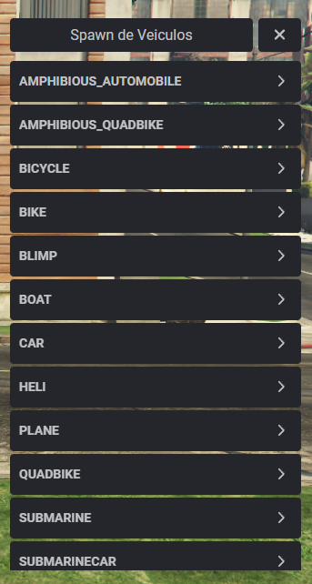

# Vehicle Spawner for FiveM

A vehicle spawner using ox_lib and ESX.

Now... ESX is only used for the `SpawnVehicle` function, just because. If you don't like it just adapt to your requirements.

The display names for the vehicle list are in Portuguese as `parser.lua` is also coded to parse the vehicles with a portuguese display name. Use this file to adjust to your language.

I parsed `vehicles.json` from [Durty Free's Vehicle Data Dump](https://raw.githubusercontent.com/DurtyFree/gta-v-data-dumps/master/vehicles.json)
